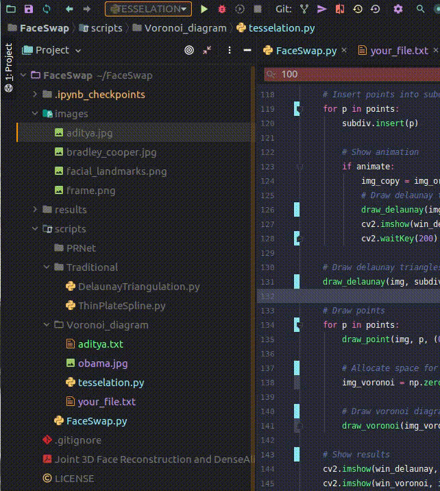
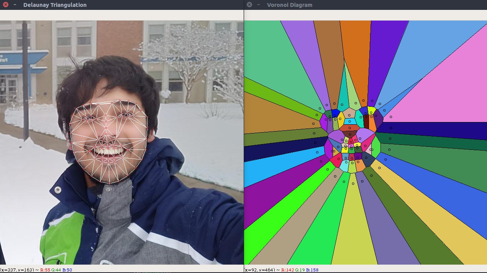

[](https://www.repostatus.org/#wip)
[](https://github.com/adityavaishampayan/SFM_python)
[](https://coveralls.io/github/adityavaishampayan/SFM_cpp?branch=master)
[](https://opensource.org/licenses/MIT)

## Introduction

The aim of this project is to implement an end-to-end pipeline to swap faces in a video just like Snapchat’s face swap filter or this face swap website.

steps in the pipeline

- Traditional Approach
    - Facial Landmarks detection
    - Face Warping using Triangulation
    - Face Warping using Thin Plate Spline
    - Replace Face
    - Blending
    - Motion Filtering

## Authors
 - Aditya Vaishampayan

## License
License file can be found [here](https://github.com/adityavaishampayan/SFM_cpp/blob/master/LICENSE)

```
MIT License

Copyright (c) 2020 Aditya Vaishampayan

Permission is hereby granted, free of charge, to any person obtaining a copy
of this software and associated documentation files (the "Software"), to deal
in the Software without restriction, including without limitation the rights
to use, copy, modify, merge, publish, distribute, sublicense, and/or sell
copies of the Software, and to permit persons to whom the Software is
furnished to do so, subject to the following conditions:

The above copyright notice and this permission notice shall be included in all
copies or substantial portions of the Software.

THE SOFTWARE IS PROVIDED "AS IS", WITHOUT WARRANTY OF ANY KIND, EXPRESS OR
IMPLIED, INCLUDING BUT NOT LIMITED TO THE WARRANTIES OF MERCHANTABILITY,
FITNESS FOR A PARTICULAR PURPOSE AND NONINFRINGEMENT. IN NO EVENT SHALL THE
AUTHORS OR COPYRIGHT HOLDERS BE LIABLE FOR ANY CLAIM, DAMAGES OR OTHER
LIABILITY, WHETHER IN AN ACTION OF CONTRACT, TORT OR OTHERWISE, ARISING FROM,
OUT OF OR IN CONNECTION WITH THE SOFTWARE OR THE USE OR OTHER DEALINGS IN THE
SOFTWARE.
```

## Structure
``` text
.
├── images
│   ├── aditya.jpg
│   ├── bradley_cooper.jpg
│   ├── facial_landmarks.png
│   └── frame.png
├── Joint 3D Face Reconstruction and DenseAlignment with Position Map RegressionNetwork.pdf
├── LICENSE
├── README.md
├── results
│   ├── face_image_1.png
│   ├── face_image.png
│   ├── facial_landmarks_1.png
│   ├── facial_landmarks.png
│   ├── frame_1.png
│   └── frame.png
├── scripts
│   └── FaceSwap.py
├── shape_predictor_68_face_landmarks.dat
└── Wrapper.py
```
## Results
||
|:--:|
| *Delaunay Triangulation* |

| |
|:--:|
| *Voronoi tessellation* |

## Dependencies
Simple starter python project with:

- OpenCV - (OpenCV uses a BSD license and hence can be used for production with modification to the code.)
- googletest [Gtest](http://wiki.ros.org/gtest)
- Travis CI [Documentation](https://docs.travis-ci.com/user/for-beginners/)
- Coveralls [Documentation](https://docs.coveralls.io/about-coveralls)

## OpenCV installation
```
Update packages
sudo apt-get update
sudo apt-get upgrade
```
We will install required dependencies
```
sudo apt-get install build-essential checkinstall cmake pkg-config yasm
sudo apt-get install git gfortran
sudo apt-get install libjpeg8-dev libjasper-dev libpng12-dev
 ```
If you are using Ubuntu 14.04
```
sudo apt-get install libtiff4-dev
```
If you are using Ubuntu 16.04
```
sudo apt-get install libtiff5-dev
```

```
sudo apt-get install libavcodec-dev libavformat-dev libswscale-dev libdc1394-22-dev
sudo apt-get install libxine2-dev libv4l-dev
sudo apt-get install libgstreamer0.10-dev libgstreamer-plugins-base0.10-dev
sudo apt-get install qt5-default libgtk2.0-dev libtbb-dev
sudo apt-get install libatlas-base-dev
sudo apt-get install libfaac-dev libmp3lame-dev libtheora-dev
sudo apt-get install libvorbis-dev libxvidcore-dev
sudo apt-get install libopencore-amrnb-dev libopencore-amrwb-dev
sudo apt-get install x264 v4l-utils
 ```
Optional dependencies
```
sudo apt-get install libprotobuf-dev protobuf-compiler
sudo apt-get install libgoogle-glog-dev libgflags-dev
sudo apt-get install libgphoto2-dev libeigen3-dev libhdf5-dev doxygen
```
Clone OpenCV and OpenCV_contrib
```
git clone https://github.com/opencv/opencv.git
cd opencv
git checkout 3.3.1
cd ..

git clone https://github.com/opencv/opencv_contrib.git
cd opencv_contrib
git checkout 3.3.1
cd ..
```
Make build directory
```
cd opencv
mkdir build
cd build
```
Run Cmake
```
cmake -D CMAKE_BUILD_TYPE=RELEASE \
      -D CMAKE_INSTALL_PREFIX=/usr/local \
      -D INSTALL_C_EXAMPLES=ON \
      -D INSTALL_PYTHON_EXAMPLES=ON \
      -D WITH_TBB=ON \
      -D WITH_V4L=ON \
      -D WITH_QT=ON \
      -D WITH_OPENGL=ON \
      -D OPENCV_EXTRA_MODULES_PATH=../../opencv_contrib/modules \
      -D BUILD_EXAMPLES=ON ..
```
Find out number of CPU cores in your machine
```
nproc

# substitute 4 by output of nproc
make -j4
sudo make install
sudo sh -c 'echo "/usr/local/lib" >> /etc/ld.so.conf.d/opencv.conf'
sudo ldconfig
```
For installation related issues.

A complete OpenCV installation guide in Ubuntu can be found [here](http://www.codebind.com/cpp-tutorial/install-opencv-ubuntu-cpp/).

## Building

Build by making a build directory (i.e. `build/`), run `cmake` in that dir, and then use `make` to build the desired target.

Example:

``` bash
> mkdir build && cd build
> cmake .. -DCMAKE_BUILD_TYPE=[Debug | Coverage | Release]
> make
> ./main
> make test      # Makes and runs the tests.
> make coverage  # Generate a coverage report.
> make doc       # Generate html documentation.
```

